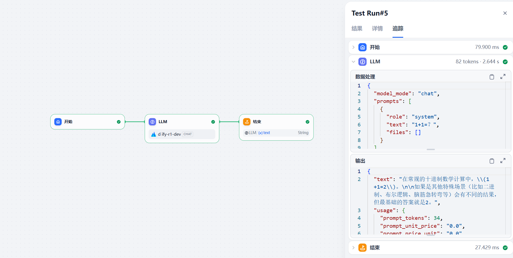

# 文档

- [Workflows 编排框架](docs/workflows.md)：`workflows.skeletons` 各模块说明与可运行示例
- [Workflows 模块初始化](docs/module_init.md)：通过配置文件等方法进行模块初始化
- [Components 组件](docs/components.md)：任务入口、落库回调、HTTP 装配与外部客户端

# Quick Start

## 从dify工作流中初始化


dify工作流导出为`test.yml`文件

```python
import json

from workflows import skeletons


model = skeletons.Module.from_dify_config_file('test.yml')
result = model(
    {
        'task_id': 'demo',
        'kwargs': {
            # this workflow has no start variables
        },
    },
)
print(json.dumps(result, ensure_ascii=False, indent=2, default=str))
"""
{
  "task_id": "demo",
  "data": {
    "_dify": {
      "1790048098684": {},
      "1790048100846": {
        "text": "1+1=2。"
      }
    },
    "out1": "1+1=2。"
  }
}
"""
```
