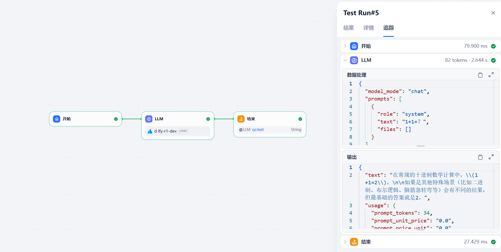
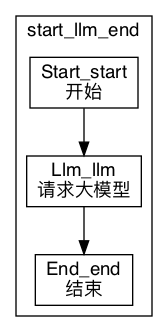

# 使用文档

- [Workflows 编排框架](docs/workflows.md)：已有模块说明及其简单的使用示例
- [Workflows 模块初始化](docs/module_init.md)：详细介绍了模块初始化的流程和方法
- [Components 组件](docs/components.md)：包含了接口框架定义、异常捕抓回调、常用大模型api调用等封装工具类

# Quick Start

## 从dify工作流中初始化

本例子介绍了怎么使用该项目快速的从dify工作流中部署一条可发布的服务接口，从而实现从前端低代码平台流程设计，到后端服务快速落地的流程。

### dify工作流设计



工作流导出一份`xxx.yml`配置文件

### 基础入门

#### 生成一个可运行的model

```python
import json

from workflows import skeletons


model = skeletons.Module.from_dify_config_file('dify_configs/xxx.yml')
result = model(
    {
        'task_id': 'demo',
        'kwargs': {
            # this workflow has no start variables
        },
    },
)
print(json.dumps(result, ensure_ascii=False, indent=2, default=str))
"""
{
  "task_id": "demo",
  "data": {
    "_dify": {
      "1790048098684": {},
      "1790048100846": {
        "text": "1+1=2。"
      }
    },
    "text": "1+1=2。"
  }
}
"""
```

生成一个流程图

```python
model.flow_chat('xxx', format='png')
```



#### 生成一条可运行的api接口

接口部署

```python
from workflows import skeletons
from components import dify_helper, api

model = skeletons.Module.from_dify_config_file('dify_configs/xxx.yml')

configs = {
    "Api": {
        "": {
            "/xxx": {
                "model_instance": model,
                "request_template": dify_helper.dify_register_modules.get("Request", "xxx"),
                "response_template": dify_helper.dify_register_modules.get("Response", "xxx")
            }
        }
    }
}

app = api.create_app(configs)

if __name__ == '__main__':
    import uvicorn

    uvicorn.run(
        app=app,
        host='0.0.0.0',
        port=8000,
    )
```

接口访问

```bash
curl -X 'POST' \
  'http://127.0.0.1:8000/xxx' \
  -H 'accept: */*' \
  -H 'Content-Type: application/json' \
  -d '{
  "task_id": "demo",
  "kwargs": {}
}'
```

接口返回

```json
{
  "task_id": "demo",
  "code": 200,
  "message": "success",
  "data": {
    "text": "1+1=2。"
  }
}
```


###  进阶使用

#### 生成一份model文件

```python
from scripts import dify2module

gen = dify2module.CodeGenerator('dify_configs/xxx.yml')
gen.to_files('models')
```

生成的脚本`models/xxx.py`可进行二次开发

#### 服务接口部署

创建一份接口部署的配置文件`configs/example.yml`

```yaml
Api:
  '':
    '/xxx':
      model_instance: models.xxx.Model
      request_template: models.xxx.Request
      response_template: models.xxx.Response
```

接口部署

```python
from utils import os_lib
from components import api

configs = os_lib.loader.load_yaml('test.yml')

app = api.create_app(configs)

if __name__ == '__main__':
    import uvicorn

    uvicorn.run(
        app=app,
        host='0.0.0.0',
        port=8000,
    )
```

接口访问

```bash
curl -X 'POST' \
  'http://127.0.0.1:8000/xxx' \
  -H 'accept: */*' \
  -H 'Content-Type: application/json' \
  -d '{
  "task_id": "demo",
  "kwargs": {}
}'
```

接口返回

```json
{
  "task_id": "demo",
  "code": 200,
  "message": "success",
  "data": {
    "text": "1+1=2。"
  }
}
```